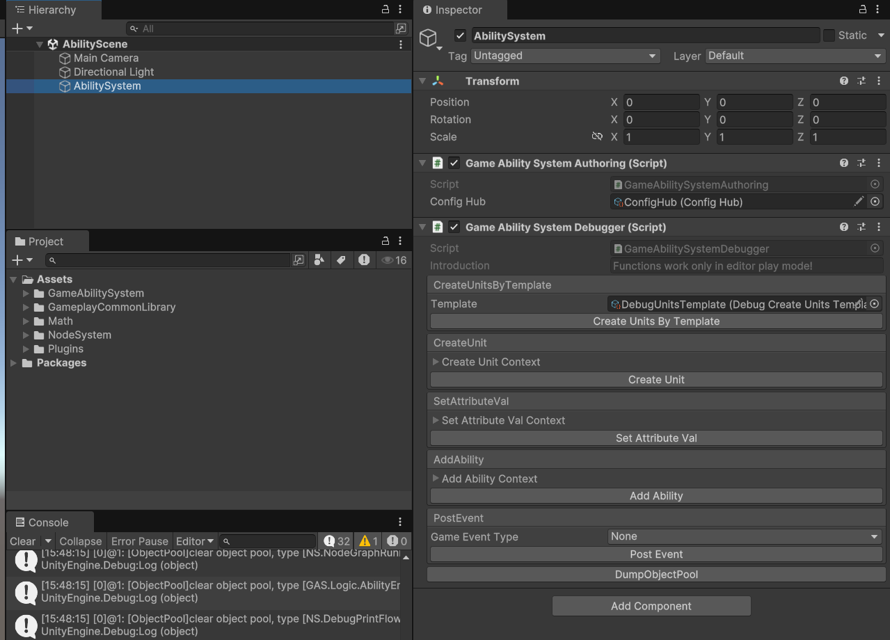
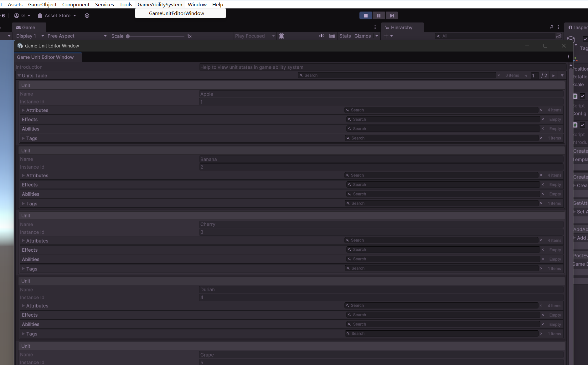
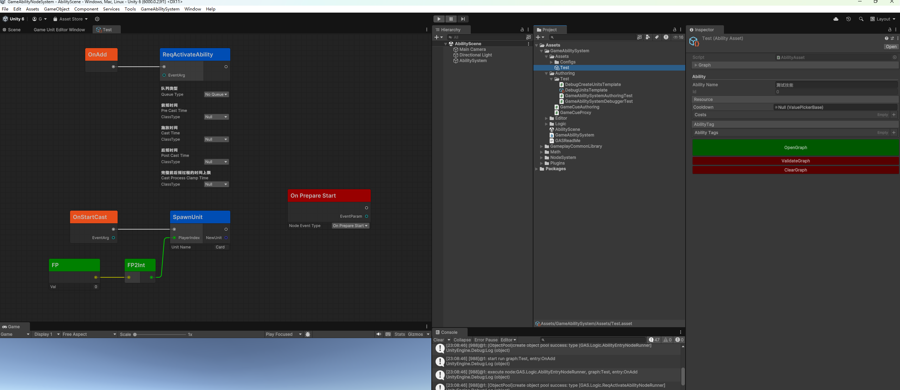

# GameAbilitySystem
### 一、 简介
基于Unity的GraphView package构建了一套比较粗糙的可编辑节点系统NodeGraphSystem。在此之上，技能AbilityAsset继承自NodeGraphAsset，支持节点编辑，并以此为中心构建了一套技能系统，即GameAbilitySystem。

### 二、基本概念
#### 1.  Unit （游戏单位）
游戏单位拥有属性（Attribute），技能（Ability)，效果（Effect），标签（Tag）等等，是系统里的交互对象。
#### 2. Ability（游戏技能）
游戏技能是实现各种功能的核心。AbilityAsset支持节点编辑，通过自定义节点来拓展功能。默认的生命周期有：OnAdd, OnRemove，OnTick，OnInstigatorDestroy等等。可以添加GameEventEntryNode来监听游戏中的事件做出响应。激活Ability需要提交ActivationReqJob（提交时，需要配置前后摇等数据，便于全局管理效果的激活过程，比如在一些情况下，效果的激活需要排队），在激活时会依次触发OnStartPreCast， OnStartCast，OnStartPostCast，OnEndPostCast。
#### 3. Effect（游戏效果）
Ability通过Effect来影响单位身上的属性
#### 4. Attribute （单位属性）
分为Simple和Composite两种。Simple属性可以直接修改其Value，而Composite属性则是通过公式计算得出Value，不可直接修改。属性相关的类还有ValueSetter和ValueDecorator。ValueDecorator可以对属性值进行一些修饰，如最大值限制。改变属性的Value值则必须通过ValueSetter，在这里可以定义一些在单位语境下的属性值变化，比如伤害需要在护盾值抵消一部分后才能减少生命值。
#### 5. GameEvent （游戏事件）
系统里的事件，主要用于Ability的触发
#### 6. Tag （标签）
简单的枚举类型，单位和技能都有各自的标签，可以用来做逻辑的分支，检索不同标签的单位等等。
#### 7. GameCue 
用来触发表现相关逻辑，比如属性变化需要触发UI表现，技能激活需要触发粒子特效和模型动画等等。
#### 8. Command
外部的一些游戏特化的指令，如召唤单位等等

# 测试

一个简单的测试环境

简单的查看单位状态的窗口

简单的测试技能资源
